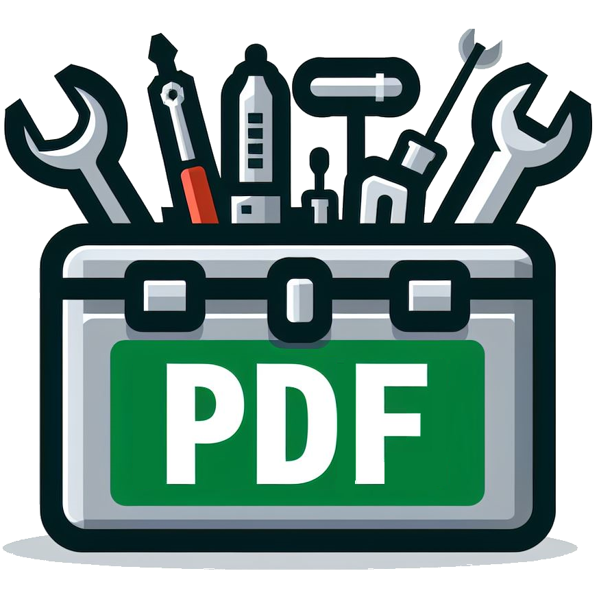

 
<strong> Minimum-pdf-tools</strong>

pypdfによるPDF結合・分割/GhostscriptによるPDF圧縮にちょっとしたUIを付けるツール（初期はPyPDF2を検討しておりましたが、[PyPDF2のPypiサイト](https://pypi.org/project/PyPDF2/)によれば「v3.0.X（2022/12/31リリース）で開発を停止してルーツであるpypdfで開発を続ける」とのことだったので、pypdfを利用しています）。

## Requirement
  - pypdf
  - send2trash
  - charset-normalizer
  - chardet
  - cchardet

## Usage

Requirementにあるパッケージを入れたPython環境（仮想でも生でもよい）とGhostscriptをまずは用意し、そのうえで個々のディレクトリに入っているmain.pyを実行する。そうすればTkinterによるダイアログがぼちぼち出てくるのでそれに従う感じ。 
mergerは保存名聞いてきますが、既にあるやつに上書きしようとするとバグります。

## Features
データが無いときに警告したり、pdf-mergerで保存時に.pdf付け忘れた場合に勝手に付け足すくらいしかないです。

## History
2023/4/2
* 公開

2023/4/3
* データが無いときの処理を追加
* Python自体の終了処理を追加
* readme.md修正

2023/4/4
* 個々の作業を関数にしてパッケージ化
* 読み込みの仕様により逆順になる場合に対しての並べ替え機能追加
* 上記に伴う確認メッセージ追加
* Python自体の終了処理をより追加 (削除時のCOM surrogate防止)

2023/10/22
* gitignoreを追加
* GhostScriptにUIを付けるためのpdf-compressor追加

2023/10/23
* linter/formatterでコードを整理

2023/11/03
* MITライセンスの付与
* .gitignore/readme.md修正

2023/11/09
* isortでモジュール整理
* pdf-merger後に圧縮/結合元ファイルのゴミ箱送りのオプションを追加

2023/11/10
* GhostScriptの圧縮の設定をいじるウィンドウを追加

2023/11/11
* 上書きする際のSend2trash回避処理の追加
* 不要コードの削除
* 変数名・コードの統一

2023/11/18
* 3ツールを1つのmain.pyに統一し選択式へ

2023/12/11
* ロゴを追加

2023/12/13
* main.pyの誤植によるバグ修正
* readme.md更新

2023/12/20
* 結合について、並べ替えの順番を任意に決定可能に
* 結合後のオプションをmerging関数に統合
* readme.md更新

## Author

 
<strong>Thinqat(Thinqat1985731)</strong>

## Lisence
This project is licensed under the MIT License, see the LICENSE file for details
